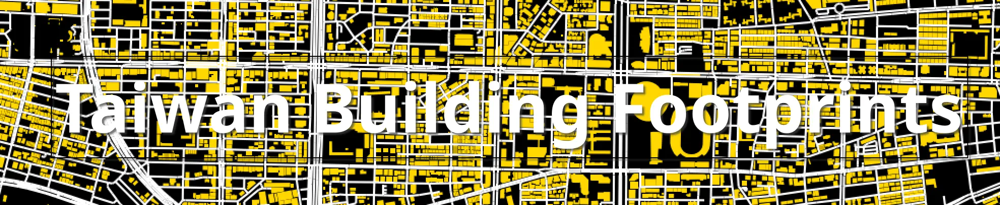

# Taiwan Building Footprint



## OSM Address and Building Analysis 

#### FILES:
- Code - `building_visualize.py`
- Jupyter Book - `taiwna-building-footprint/`

#### RESULT: 
- [analysis/visualize on Jupyter book](https://liquidcs.github.io/Taiwan-Buildings-Footprint/intro.html)
- [Raw Data without Visualization](https://github.com/liquidCS/Taiwan-Buildings-Footprint/blob/main/out/data/analysis_building%26addr.csv)

#### DEPENDENCY 
- Osmium
    - [Installation Guide](https://osmcode.org/osmium-tool/manual.html#installation)
- Python Library 
    - pandas, geopandas, pyrosm
    - zipfile
    - matplotlib

#### RUN
```
pip install -r requirements.txt
python building_visualize.py [county_id] 
```

#### OPTIONS
```
usage: building_visualize.py [-h] [--buildingWithRoad] [--addressAnalysis] [--radius] [--showFootprint] [--detailAddressAnalysis] [--saveCSV] county_id

Generate graphs using OSM data.

positional arguments:
  county_id             The county ID you want to generate.

options:
  -h, --help            show this help message and exit
  --buildingWithRoad    Generate image with buildings and roads
  --addressAnalysis     Generate image of address where green means address loacation is in building and red is outside the building.
  --radius              Analysis address with a margin of 2m of error when consider whether it is in a building.
  --showFootprint       Show building outline when generating address analysis.
  --detailAddressAnalysis
                        Generate image of building with different colors representing how many address a building has.
  --saveCSV             Store analysis result to out/data/analysis_building&addr.csv
```


## Tiles Generation

Files:
- under `tiles/`


## Building Segmentation


