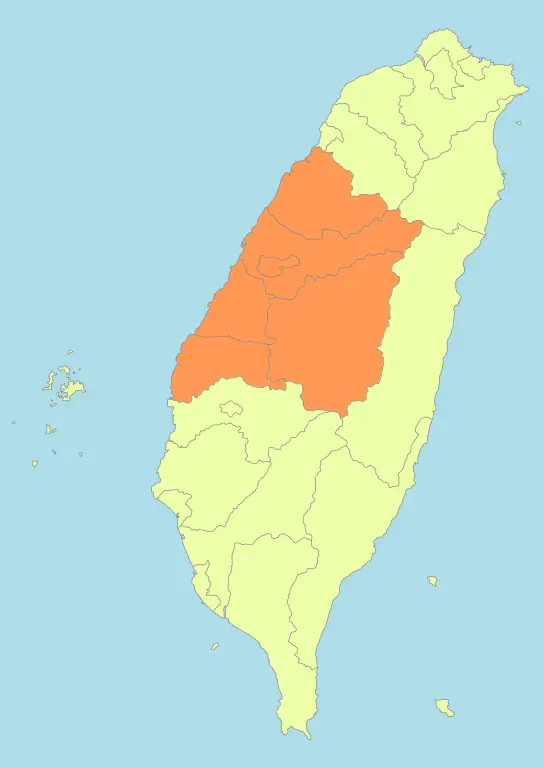

```{margin} Description
🏘️ -  Building Count<br>
📍 - Address Count 
```
```{margin} Region

By <a href="//commons.wikimedia.org/wiki/User:Luuva" class="mw-redirect" title="User:Luuva">Luuva</a> - <span class="int-own-work" lang="en">Own work</span>, <a href="https://creativecommons.org/licenses/by-sa/3.0" title="Creative Commons Attribution-Share Alike 3.0">CC BY-SA 3.0</a>, <a href="https://commons.wikimedia.org/w/index.php?curid=10596525">Link</a>
```
# 中部 - Central Taiwan

### 台中市
:::{dropdown} {bdg-info-line}`🏘️ - 54951 📍- 1189956` {bdg-success}`Official Addresses`   
Building Plot

Address Plot


```
### 苗栗縣 
:::{dropdown} {bdg-info-line}`🏘️ - 8683 📍- 209633` {bdg-success}`Official Addresses`   
Building Plot

Address Plot


:::

### 彰化縣
:::{dropdown} {bdg-info-line}`🏘️ - 40113 📍- 421583` {bdg-success}`Official Addresses`   
Building Plot

Address Plot


:::

### 雲林縣 
:::{dropdown} {bdg-info-line}`🏘️ - 15974 📍- 258052` {bdg-success}`Official Addresses`   
Building Plot

Address Plot


:::

### 南投縣
:::{dropdown} {bdg-info-line}`🏘️ - 9275 📍- 1613` {bdg-danger}`No Official Addresses`   
Building Plot

Address Plot


:::
