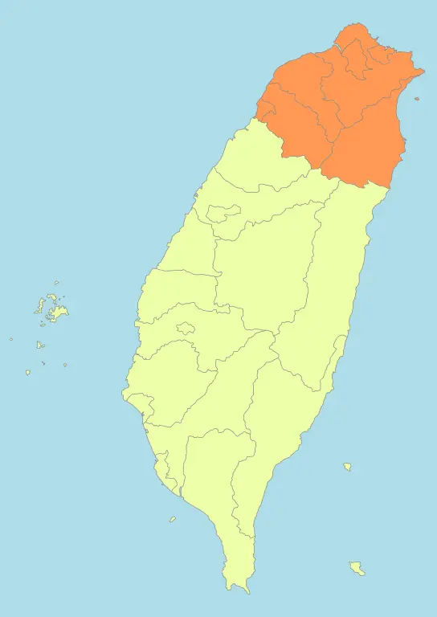

```{margin} Region
 
By <a href="//commons.wikimedia.org/wiki/User:Luuva" class="mw-redirect" title="User:Luuva">Luuva</a> - <span class="int-own-work" lang="en">Own work</span>, <a href="https://creativecommons.org/licenses/by-sa/3.0" title="Creative Commons Attribution-Share Alike 3.0">CC BY-SA 3.0</a>, <a href="https://commons.wikimedia.org/w/index.php?curid=10596527">Link</a>
```

# 北部 - Northen Taiwan

```{dropdown} 台北市
Building Plot

Address Plot


```

```{dropdown} 新北市
Building Plot

Address Plot


```

```{dropdown} 桃園市 
Building Plot

Address Plot


```

```{dropdown} 新竹市
Building Plot

Address Plot


```

```{dropdown} 新竹縣
Building Plot

Address Plot


```

```{dropdown} 基隆市
Building Plot

Address Plot


```

```{dropdown} 宜蘭縣 
Building Plot

Address Plot


```
