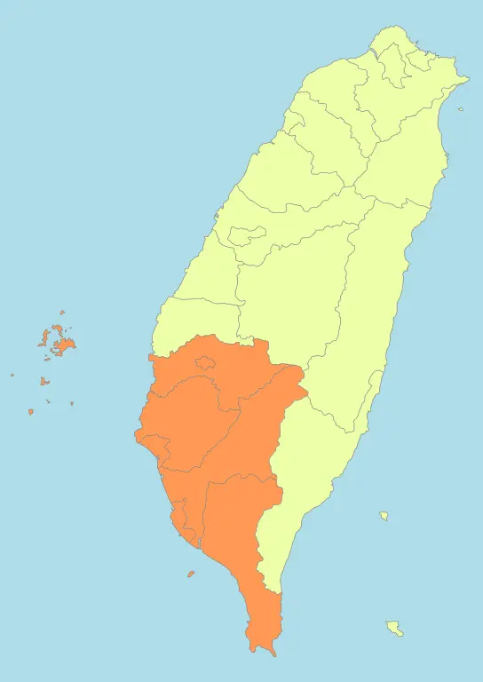

```{margin} Description
🏘️ - Building Count<br>
📍 - Address Count 
```

```{margin} Region

By <a href="//commons.wikimedia.org/wiki/User:Luuva" class="mw-redirect" title="User:Luuva">Luuva</a> - <span class="int-own-work" lang="en">Own work</span>, <a href="https://creativecommons.org/licenses/by-sa/3.0" title="Creative Commons Attribution-Share Alike 3.0">CC BY-SA 3.0</a>, <a href="https://commons.wikimedia.org/w/index.php?curid=10596528">Link</a>
```
# 南部 - Southern Taiwan

### 高雄市 
:::{dropdown} {bdg-primary-line}`🏘️ - 29947 📍- 1188442` {bdg-success}`Official Addresses`
Building Plot

Address Plot


:::

### 台南市 
:::{dropdown} {bdg-primary-line}`🏘️ - 43179 📍- 791842` {bdg-success}`Official Addresses`
Building Plot

Address Plot


```

### 嘉義市
:::{dropdown} {bdg-primary-line}`🏘️ - 4642 📍- 666` {bdg-success}`No Official Addresses`
Building Plot

Address Plot


:::

### 嘉義縣
:::{dropdown} {bdg-primary-line}`🏘️ - 13706 📍- 166524` {bdg-success}`No Official Addresses`
Building Plot

Address Plot


:::

### 屏東縣
:::{dropdown} {bdg-primary-line}`🏘️ - 10753 📍- 288772` {bdg-success}`No Official Addresses`
Building Plot

Address Plot


:::
