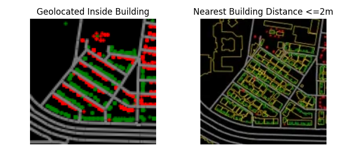
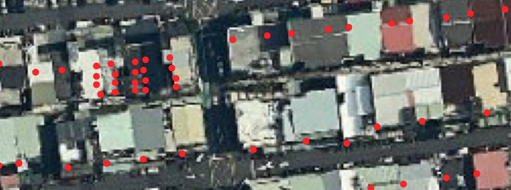

# 分析 - Analysis

1. **地址點位精準度**

    經過圖表分析後，會發現大多數的建築都有對應的地址點位，不過還是有許多問題：1. 因為地址點位是人工點的，點位沒有在房屋固定的位置時常會亂飄，這可能會造成很多使用上的困擾 2. 大多數的點位都與OSM上的建築有交集大約75%，不過還是有大約25%的地址點位在與建築物相差2m的距離，代表還是有很多誤差。如果要使用這些地址資料還需要在做處理才能使用，例如：先將地址點將點位相對最近的道路往後推移，以確定地址點位不會在建築物的邊緣或外面。

2. **公寓地址點位**

    在分析地址時特別注意到了公寓住址的問題，從Github：out/data資料中看到台北市中一棟建築物內有大於50個地址的有1982棟。看過這些公寓後我發現了公寓的地址可能會有以下兩種情況：全部擠在一起、或在建築物裡整齊的排放。因為我的預設情況是一個地址為一個建築物，所以如果要使用這些資料就要先整裡所有的地址，利用門牌號碼裡的”樓、之”可以分辨是否是公寓的地址，並留下其中一個或用所有的點找中心點當作公寓的代表地址點位。

