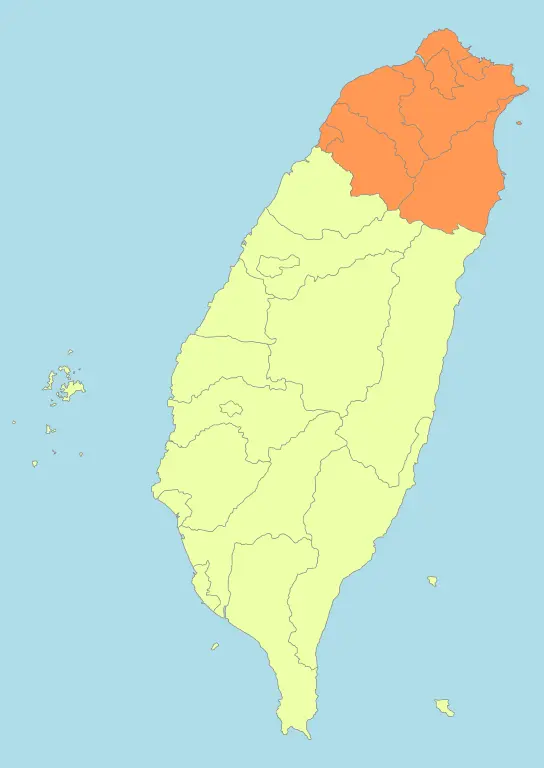

```{margin} Description
🏘️ - Building Count<br>
📍 - Address Count 
```
```{margin} Region
 
By <a href="//commons.wikimedia.org/wiki/User:Luuva" class="mw-redirect" title="User:Luuva">Luuva</a> - <span class="int-own-work" lang="en">Own work</span>, <a href="https://creativecommons.org/licenses/by-sa/3.0" title="Creative Commons Attribution-Share Alike 3.0">CC BY-SA 3.0</a>, <a href="https://commons.wikimedia.org/w/index.php?curid=10596527">Link</a>
```

# 北部 - Northen Taiwan
### 台北市 
:::{dropdown} {bdg-info-line}`🏘️- 76650 📍- 1119294` {bdg-success}`Official Addresses`   
Building Plot

Address Plot

Detail Address Plot

:::

### 新北市
:::{dropdown} {bdg-info-line}`🏘️- 46973 📍- 1940802` {bdg-success}`Official Addresses`   
Building Plot

Address Plot

Detail Address Plot

:::

### 桃園市
:::{dropdown} {bdg-info-line}`🏘️ - 46963 📍- 1001500` {bdg-success}`Official Addresses`   
Building Plot

Address Plot

Detail Address Plot

:::

### 新竹市
:::{dropdown} {bdg-info-line}`🏘️ - 6216 📍- 208041` {bdg-success}`Official Addresses`   
Building Plot

Address Plot

Detail Address Plot

:::

### 新竹縣
:::{dropdown} {bdg-info-line}`🏘️ - 9565 📍- 259551` {bdg-success}`Official Addresses`   
Building Plot

Address Plot

Detail Address Plot

:::

### 基隆市
:::{dropdown} {bdg-info-line}`🏘️ - 4410 📍- 187423` {bdg-success}`Official Addresses`   
Building Plot

Address Plot

Detail Address Plot

:::

### 宜蘭縣 
:::{dropdown} {bdg-info-line}`🏘️ - 11339 📍- 785` {bdg-danger}`No Official Addresses`   
Building Plot

Address Plot

Detail Address Plot

:::

