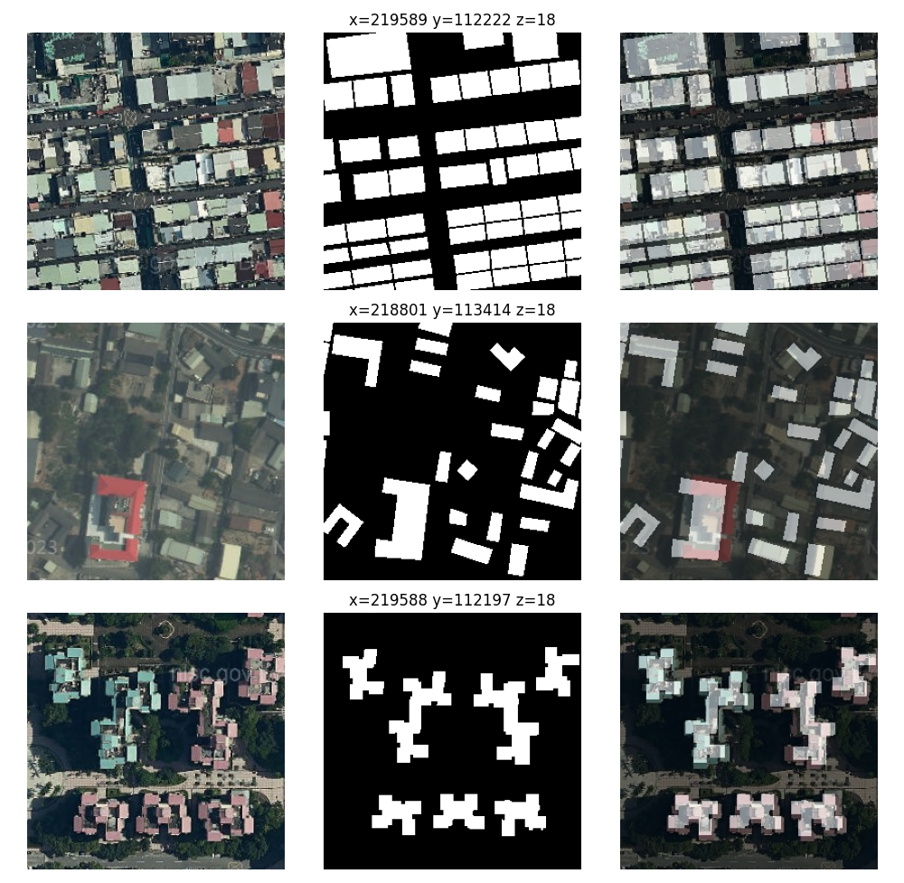

# Intro

## Binary Mask Tiles Generation

Generate binary map using OSM buildings data for training prosperous.

#### FILES 
- Code - `tiles/data.py`
- Output - `tiles/data/train_images`, `tiles/data/train_masks` 

#### RESULT


#### DEPENDENCY 
- [pyrosm](https://pypi.org/project/pyrosm/), [geopandas](https://pypi.org/project/pandas/)
- [matplotlib](https://pypi.org/project/matplotlib/), [contextily](https://contextily.readthedocs.io/en/latest/intro_guide.html)

#### RUN
```
cd tiles/
pip install -r requirements.txt
python data.py [x] [y] [z] [county_id]
```

#### OPTIONS
```
usage: data.py [-h] x y z county_id

Generate binary map using OSM buildings data.

positional arguments:
  x           x - WMP horizontal tile index
  y           y - WMP vertical tile index
  z           z - WMP zoom level
  county_id   ID of the county

options:
  -h, --help  show this help message and exit
```
County ID is needed due to pyrosm performance issue.

